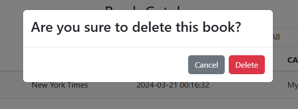
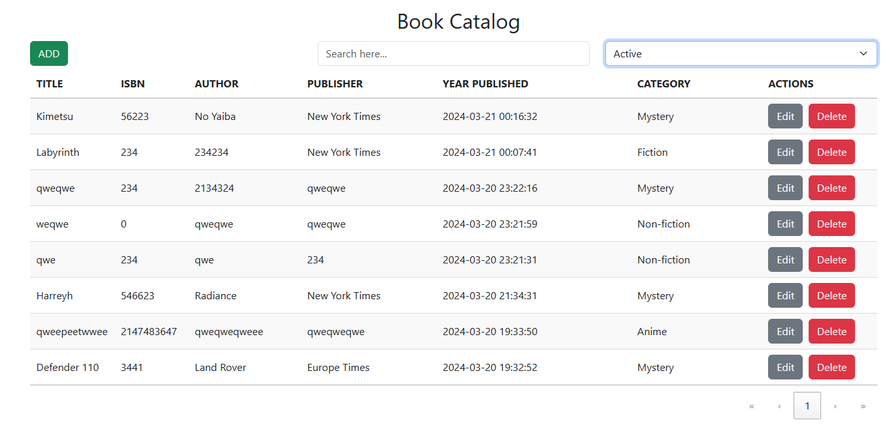
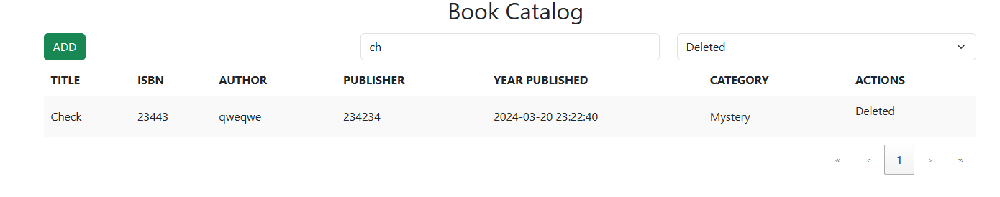

# 2024 Project 2 - Book Catalog Full Stack Development

Hi!
 
I hope everyone is fine, here is my project, actually a coding project exam as I apply for a web developer position in a certain company, and here is the title of the assigned project: Book Catalog, Project 2 this year so far.
 
Here are the few technologies that I worked on in this project:
PHP, Bootstrap, JS, JQuery, Ajax, HTML, CSS, and MySQL.
 
If you want to see and watch the entire project, feel free to visit: https://www.youtube.com/watch?v=_aaiI8tNR8M
 

Thank you.